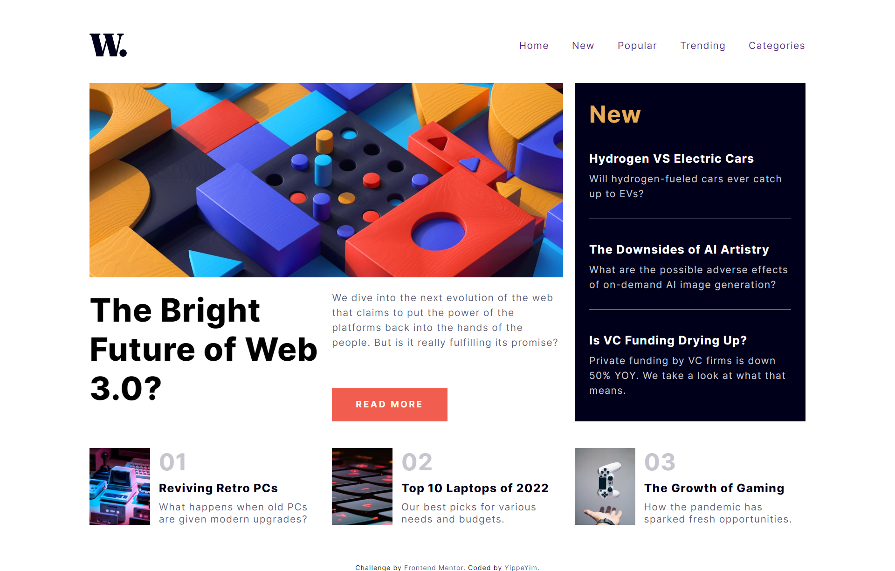
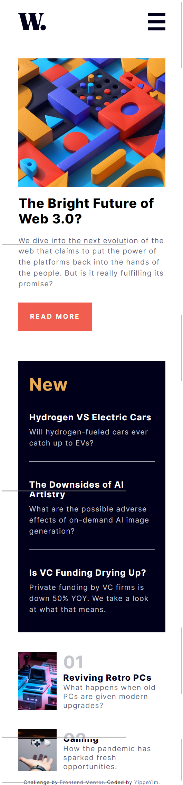

# This is my second practice website 🎆

Frontend Mentor - News homepage solution

This is a solution to the [News homepage challenge on Frontend Mentor](https://www.frontendmentor.io/challenges/news-homepage-H6SWTa1MFl). Frontend Mentor challenges help you improve your coding skills by building realistic projects. 

for someone suffering with *warning: in the working copy of 'index.html', LF will be replaced by CRLF the next time Git touches it* this can help you https://blog.devgenius.io/git-warning-lf-will-be-replaced-by-crlf-4555c0236e9b

## Table of contents

- [Overview](#overview)
  - [Screenshot](#screenshot)
  - [Links](#links)
- [My process](#my-process)
  - [Built with](#built-with)
  - [What I learned](#what-i-learned)
- [Author](#author)


## Overview

### Screenshot


*for mobile can see in Live Site*
<!--  -->


### Links

- Live Site URL: https://yippeyim.github.io/FM-02-news-homepage/
- Frontend Mentor Profile: https://www.frontendmentor.io/profile/YippeYim

## My process

### Built with

- HTML
- CSS
- Flexbox
- CSS Grid

### What I learned

- [mobile nav](https://www.youtube.com/watch?v=PGJKSf6JFsk)
- get benefit from class
- name all color
- ```css
  .class > childelement{}
  ```
- ```css
  display:grid;  <!-- make layout easier -->
  ```
- make use of width (width=0%;) maybe good?
- flex is useful
- ```css
  letter-spacing:1px;
  line-height:2px;
  ```
- div/span can make button
- ```css
  .class:nth-child(n+3){}
  ```
- try use responsive unit
- ```css
  object-fit:cover;
  ```
- @media can set :root

- *** Feel free to use JS *** it's a magic! 😝

## Author

- Frontend Mentor - [@YippeYIm](https://www.frontendmentor.io/profile/YippeYim)

